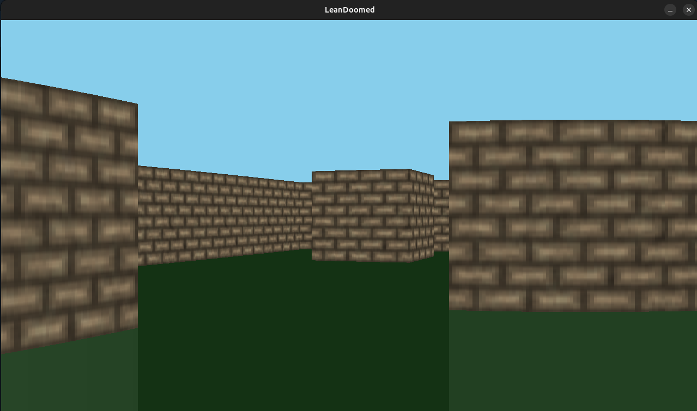

# Lean SDL3 Bindings Example

Playing around with SDL3 bindings in Lean4 to learn about the FFI.

Simple real-time Doom-style raycasting engine in Lean4:



## Cloning

When you clone, MAKE SURE YOU RUN ``git submodule update --init --recursive`` IN THE ROOT OF THIS REPOSITORY JUST TO BE SAFE

## Run

This is just an experiment

First, make sure you've set up Lean properly on your computer.

If you are on Windows, use MSYS2 or WSL 

IMPORTANT: FOR MSYS2, MAKE SURE YOU ARE USING THE "CLANG" SHELL TO RUN EVERYTHING

(For more information on MSYS2, see: https://github.com/leanprover/lean4/blob/master/doc/make/msys2.md)

Follow the "legacy" instructions from here (They should work on Linux, WSL, and MSYS2): https://leanprover-community.github.io/install/linux.html

Second, make sure you run the build script first to build all the dependencies to get this to work

```bash
chmod +x ./build_sdl_and_friends.sh
sudo ./build_sdl_and_friends.sh
```

Then you can run the game proper

```bash
lake exe LeanDoomed
```

## License

MIT
